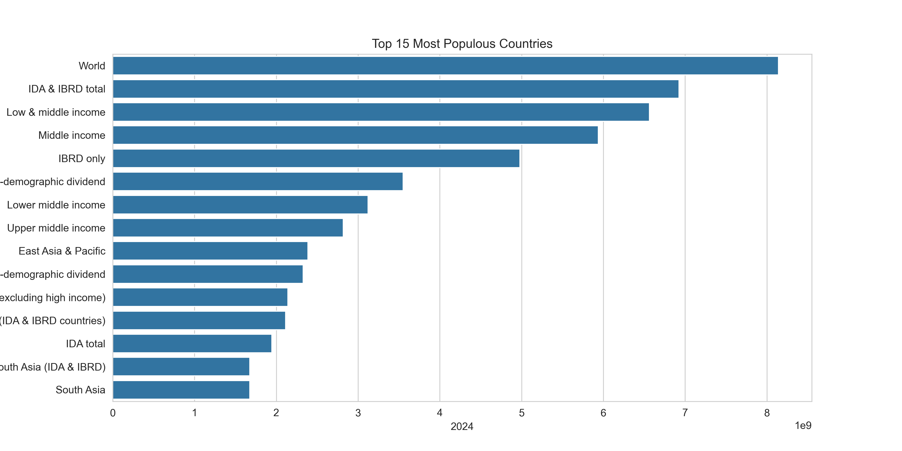
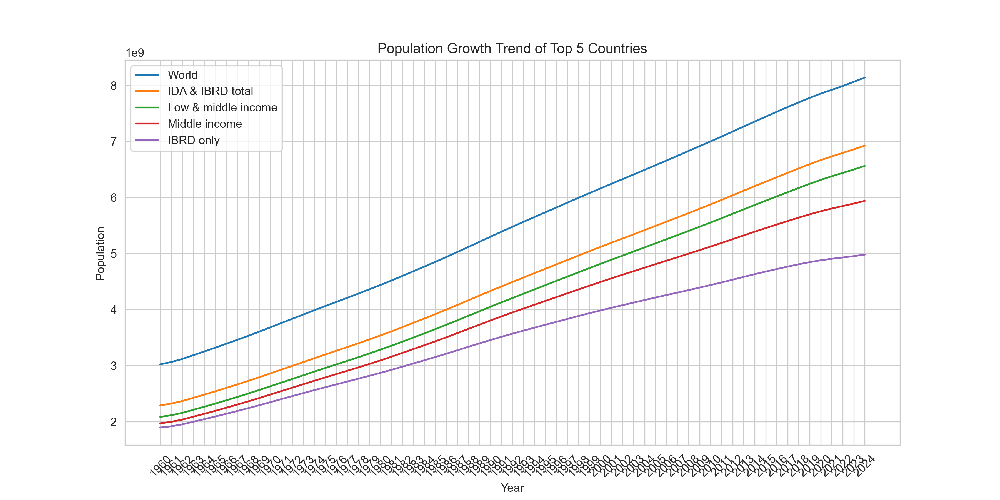

# PRODIGY_DS_01
This project visualizes the distribution of population data using bar charts and histograms as part of the Prodigy InfoTech Data Science Internship – Task 01. The objective is to analyze and represent categorical and continuous variables using Python, Pandas, and Matplotlib.
## Visualization Results

### Top 15 Countries by Population

### Global Population Share (Top 10 vs Rest)

### Population Growth Trend (Top 5)

### Top 10 Countries by Population
